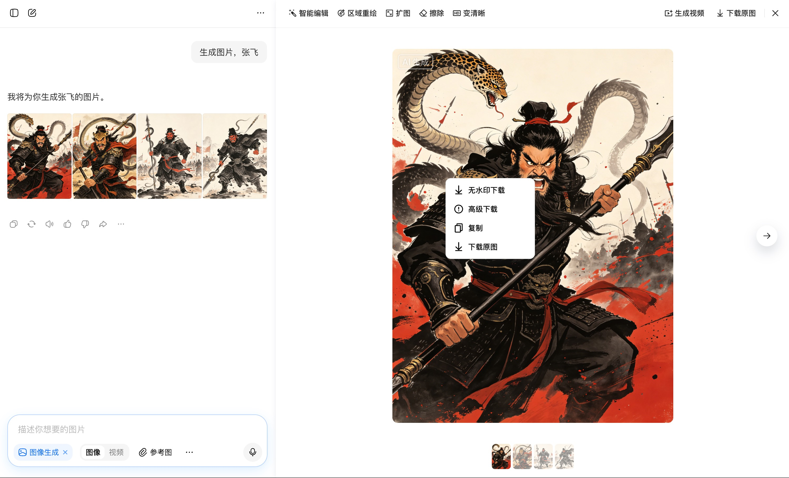
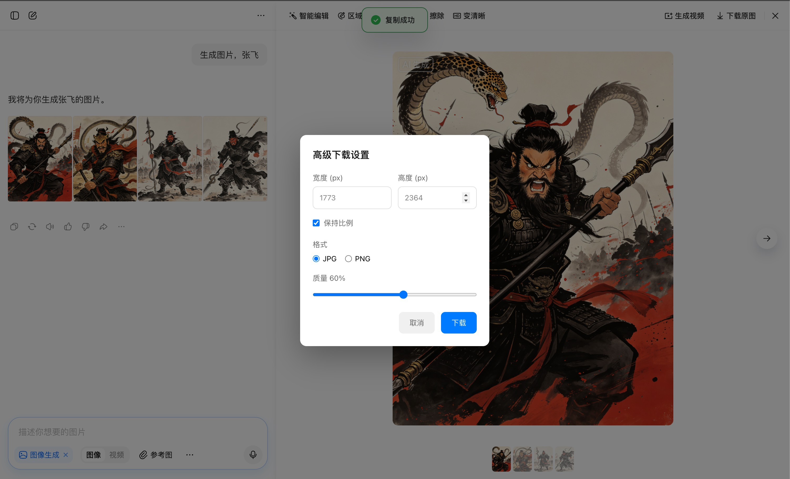

# 豆包图片无水印下载器

一个 Tampermonkey 用户脚本，用于下载豆包生成的无水印图片。

## 功能特性

- 🎯 **一键无水印下载** - 右键点击图片，选择"无水印下载"即可
- 🔧 **高级下载选项** - 支持自定义尺寸、格式（JPG/PNG）和质量设置
- 🚀 **自动化处理** - 自动获取剪贴板图片并去除水印
- 💾 **智能命名** - 自动根据日期和尺寸生成文件名
- 🎨 **友好界面** - 美观的加载提示和设置面板

## 效果展示

### 基础下载功能

### 高级下载设置

## 安装方法

1. 安装 [Tampermonkey](https://www.tampermonkey.net/) 浏览器扩展
2. 点击 [`doubao-watermark-downloader.user.js`](doubao-watermark-downloader.user.js) 文件
3. 复制脚本内容
4. 在 Tampermonkey 中创建新脚本，粘贴代码并保存
5. 访问 [豆包](https://www.doubao.com/) 开始使用

## 使用说明

### 基础下载
1. 在豆包生成图片后，点击图片打开预览面板
2. 右键点击预览图片
3. 在弹出菜单中选择"无水印下载"
4. 脚本会自动处理并下载无水印图片

### 高级下载
1. 右键点击预览图片
2. 选择"高级下载"
3. 在弹出的设置面板中：
   - 调整图片宽度和高度
   - 选择输出格式（JPG/PNG）
   - 设置 JPG 质量（10-100%）
   - 可选择是否保持宽高比
4. 点击"下载"完成

## 工作原理

脚本通过以下方式去除水印：
1. 获取预览图的高清版本
2. 自动触发复制功能获取剪贴板图片
3. 使用 Canvas API 合并两张图片
4. 精确去除水印区域（400x200 像素，位于左上角）
5. 输出处理后的无水印图片

## 技术栈

- Vanilla JavaScript
- Canvas 2D API
- MutationObserver
- Clipboard API

## 兼容性

- ✅ Chrome
- ✅ Firefox
- ✅ Edge
- ✅ Safari（需要手动授权剪贴板权限）

## 许可证

MIT License - 详见 [LICENSE](LICENSE) 文件

## 贡献

欢迎提交 Issue 和 Pull Request！

## 更新日志

### v1.2 (2024-04-14)
- 优化图片处理算法
- 添加高级下载功能
- 改进用户界面体验

---

**注意**：本脚本仅供学习和个人使用，请遵守相关法律法规和平台条款。